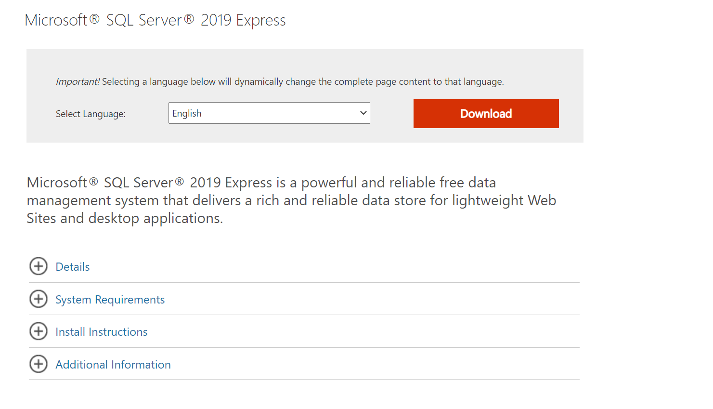
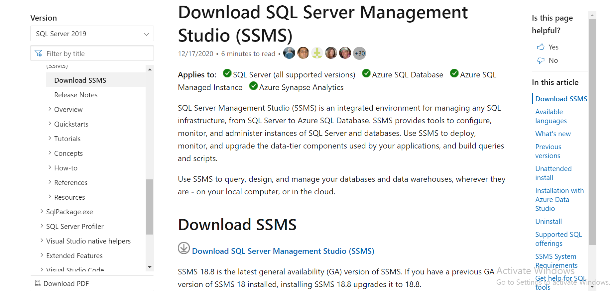
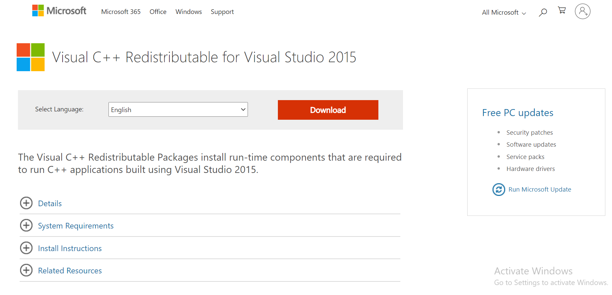
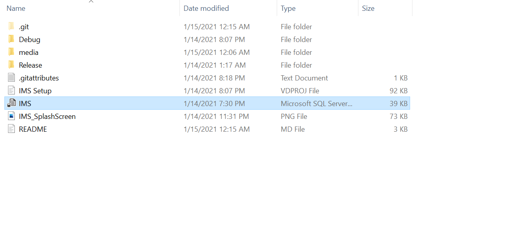
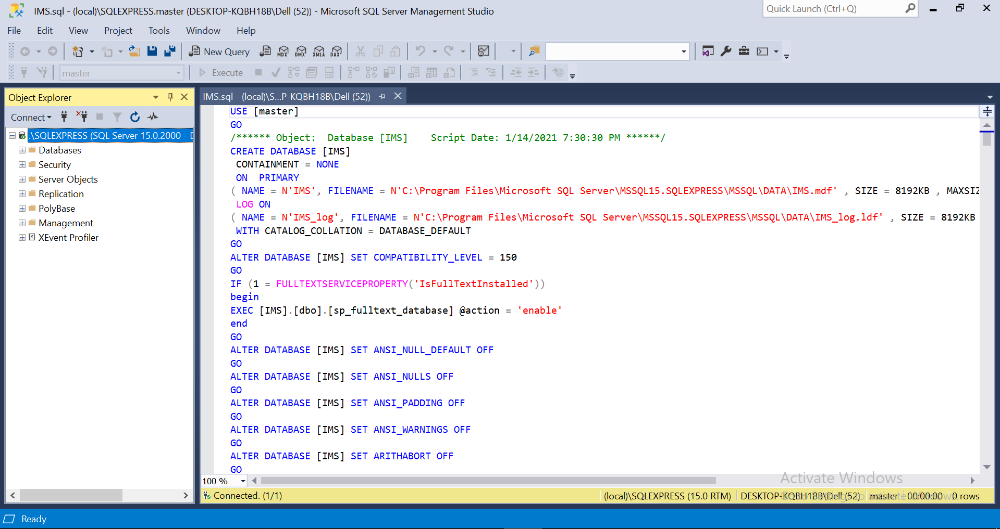
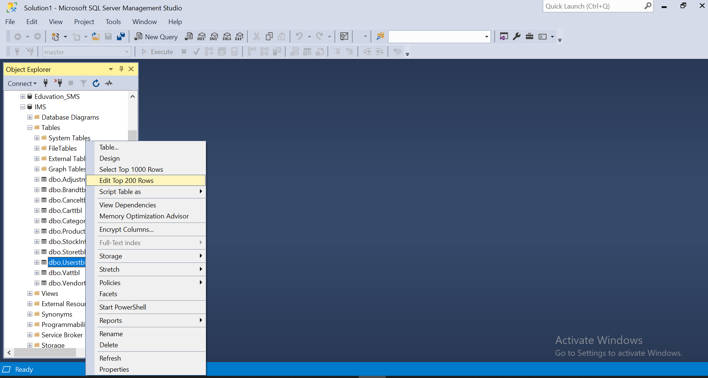
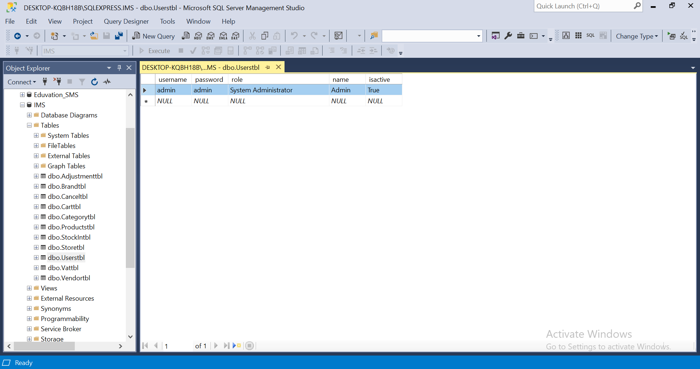
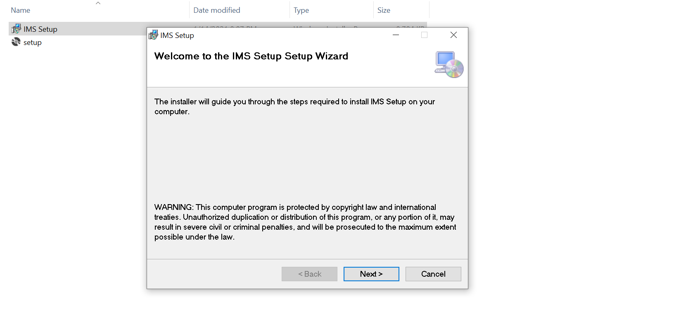
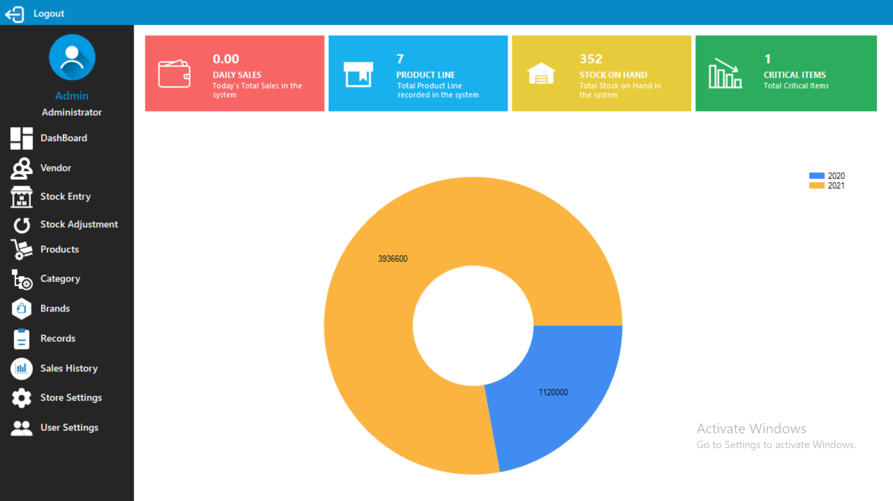
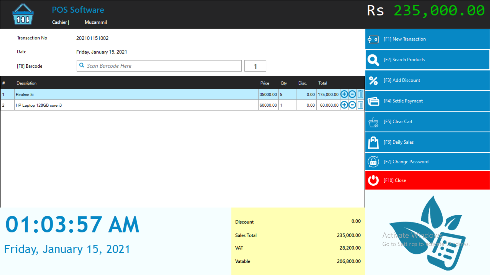

# 

## Inventory Master
* So, Basically its a desktop application based on C# programming language and SQL Server. It's a complete Inventory and Point Of Sale Software have all the functionalities and features which is required in a proper POS Software.

## User Installation Guide

### Pre-Requisite

* First of all, it has some pre-requisite for using this software you must have SQL Server Management Studio 2018 and Visual c++ redistributable for visual studio 2015 (64-bit).

[SQL Server Express 2019](https://www.microsoft.com/en-us/download/details.aspx?id=101064 "SQL Server Express 2019")

[SQL Management Studio 2018](https://docs.microsoft.com/en-us/sql/ssms/download-sql-server-management-studio-ssms?view=sql-server-ver15 "SQL Management Studio 2018")

[C++ Redistributable for VS-2015](https://www.microsoft.com/en-pk/download/details.aspx?id=48145 "C++ Redistributable for VS2015")

* After that you download the zip file of the setup and extract the files after that there is IMS.sql file you simply double click on it so it will be open in your SQL Management Studio

#### Double Click on IMS.sql

#### View In SSMS Execute Code

* Once its open you have to execute that particular file step by step. After complete execution your Database is ready to go. Now you refresh your SQL Management Studio all the tables are appear there. Now right click on the Userstbl and select edit top to 200 Rows and insert data in particular columns.

#### Step one

#### Step Two (Write details Same as it is)

* After that now back to your setup folder and run the setup file and do all the basic settings.

* After the successful completion you are ready to go. 

#### Login With Username and Password that you set in Database

Username = admin , Password = admin

## Admin Dashboard

## Cashier Dashboard / POS Dashboard

 Note: I already have some products and stock but when you install all things are zero

### Features and Functionalities ###
* Notifier For Critical Stock
* Product Management
* Brand Management
* Categories
* Stock Management
  * Stock Entry
  * Stock Adjustment
* User's Settings
  * Create Account
  * Activate / Deactivate Account
  * Change Password
* System Settings
* Point of Sales
  * Generating Bill Reciept
  * Change Password 
  * Auto Calculated Tax Value
* Records
  * Generating Critical Stock Report 
  * Generating Top Selling Items Report
  * Inventory Report
  * Stock History Report

### Developed By Webisoft Pakistan ###
* If you like the project please give me a star
* Follow Us:
[Webisoft Pakistan](http://www.facebook.com/WebisoftPakistan/ "Webisoft Pakistan")
